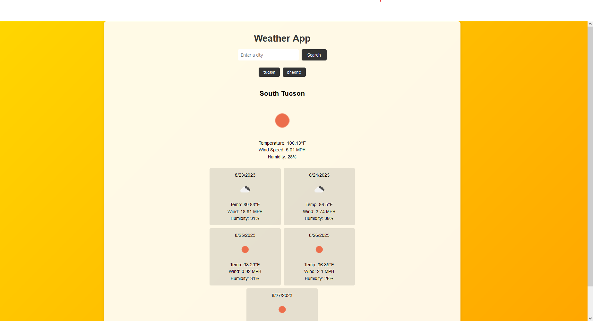

# weather_app
## link
https://github.com/kevinverduzco27/weather_app

## What did you learn? 
```

```

## What is your motivation

```
my motivation was purely to get ready for other projects 
```

## Why did you build this project?

```
this project was built in order to organize and ready their workday before class
```

## What problem does it solve?

```
this Project solves the issue of having a messy day and an unfit schedule
```
